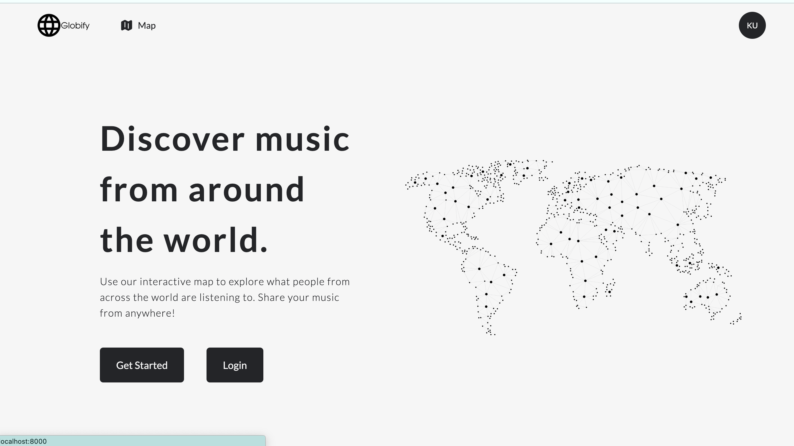
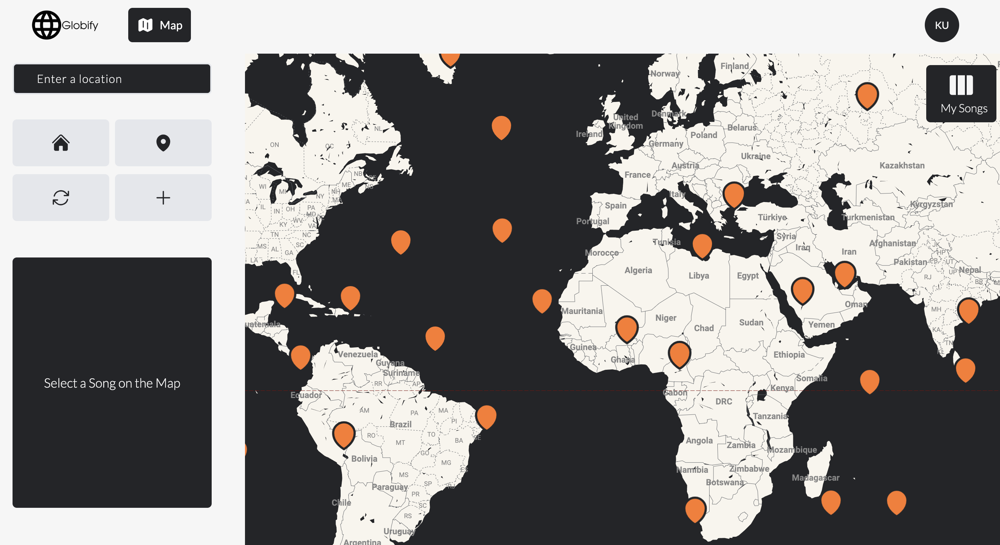
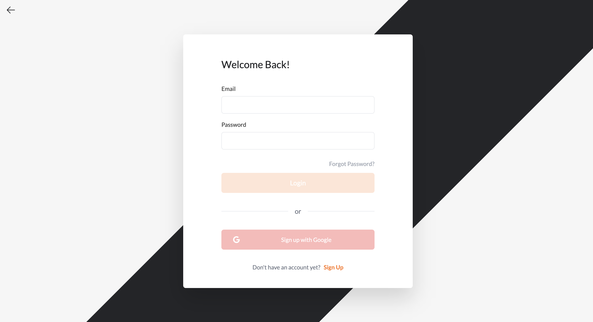

# Globify

An application to showcase songs that people are listening to from across the world, utilizing Google Maps API and Spotify API, featuring a Next.js frontend built with React, Typescript, and a Ruby on Rails backend.

## Demo

You can access the web demo at https://globify.vercel.app/

## Project Screenshots





## Project Status

Still working on a few features:

- Google search functionality
- Update responsiveness
- Fix loading of initial data
- Improve click flow
- Implement shuffle button

## Setup

Clone down this repository. You will need node and npm installed globally on your machine.

Installation:

```
npm run install
```

Run local server:

```
npm run dev
```

Backend Url: https://globify-backend.onrender.com

Backend Repo: https://github.com/KotaUeshima/globify-backend

## Libraries

**Google Maps**

```
npm install @react-google-maps/api
npm install @types/google.maps
npm install react-google-autocomplete
```

**UI Tools**

```
npm install @heroicons/react
npm install react-spinners
```

**State Management**

```
npm install react-redux
npm install @reduxjs/toolkit
```

**3D Rendering**

```
npm install three
npm install @react-three/fiber
npm install @react-three/drei
```
